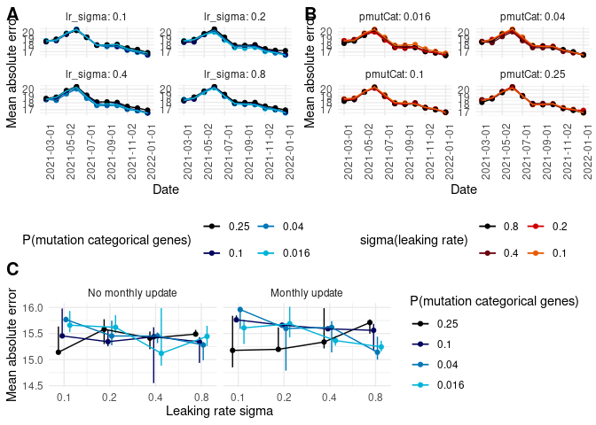
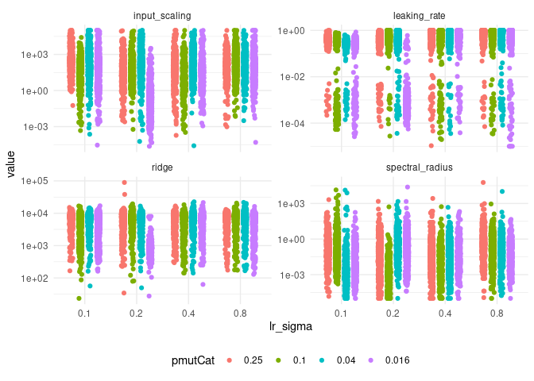
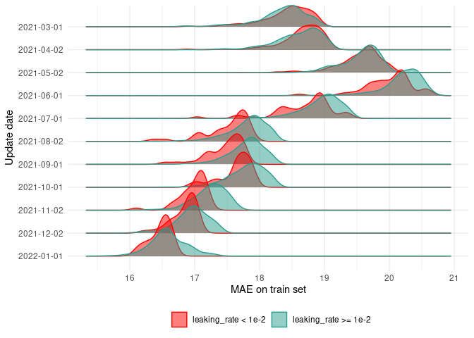
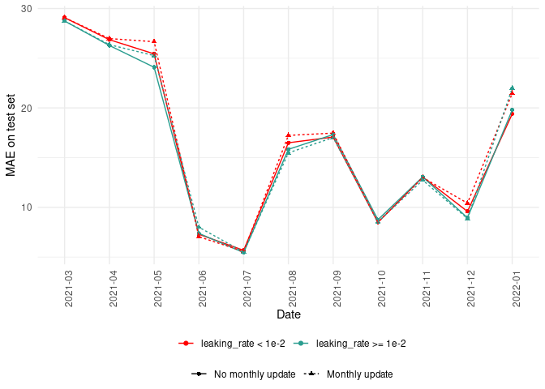
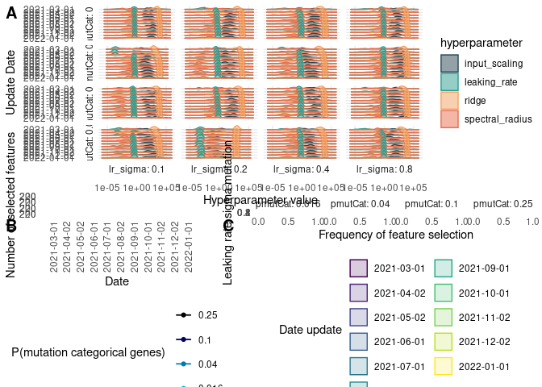

# High dimension reservoir

<link href="results_high_dim_rc_files/libs/lightable-0.0.1/lightable.css" rel="stylesheet" />

# Introduction

# Methods

## Use case

## Reservoir computing

## Genetic algorithm

## Experimental setup

### Metaparameter exploration

Choice of hyperparameters :

sigma leaking rate : because depending on setting, convergence to
different leaking rate seem to occur. Furthermore, low leaking rate
seemed to achieve better performance

pmutCat : because hyperparameter monthly update seem not to improve
performance which is counterintuitive as important features should
evolve in this context of non stationary time series.

Grid :

- sigma leaking rate = c(0.016, 0.04, 0.1, 0.25)
- pmutCat = c(0.1, 0.2, 0.4, 0.8)

# Results

## Data presentation

# Setting

Figure above describes the evolution of 4 features (RT-PCR, positive
RT-PCR, IPTCC and hospitalization) and of the outcome. We observe that
the relationship between explanatory features and the outcome evolves
over time making this problem complex.

## Forecast

### Sanity check

First, we check that there is 40 reservoir prediction for each day of
the prediction for each scenario. We observe that there is indeed a
forecast for each day. Some days have less than 40 reservoirs but the
minimum is 37 which seems acceptable.

### Performance

| short_name_model | pmutQuant | pmutCat | lr_sigma | update | MAE | MRE | MAEB | MREB |
|:---|---:|---:|---:|:---|:---|:---|:---|:---|
| PmutQuant = 0.5 ; PmutCat = 0.016 ; lr sigma = 0.1 | 0.5 | 0.02 | 0.1 | No monthly update | 15.66(15.52 ; 15.93) | 0.27(0.26 ; 0.28) | -2.93(-3.06 ; -2.65) | 0.9(0.88 ; 0.92) |
| PmutQuant = 0.5 ; PmutCat = 0.016 ; lr sigma = 0.1 | 0.5 | 0.02 | 0.1 | Monthly update | 15.61(15.3 ; 15.77) | 0.27(0.27 ; 0.28) | -2.98(-3.29 ; -2.82) | 0.87(0.87 ; 0.89) |
| PmutQuant = 0.5 ; PmutCat = 0.016 ; lr sigma = 0.2 | 0.5 | 0.02 | 0.2 | No monthly update | 15.62(15.51 ; 15.85) | 0.27(0.27 ; 0.28) | -2.97(-3.08 ; -2.74) | 0.87(0.85 ; 0.88) |
| PmutQuant = 0.5 ; PmutCat = 0.016 ; lr sigma = 0.2 | 0.5 | 0.02 | 0.2 | Monthly update | 15.69(15.43 ; 16.01) | 0.27(0.27 ; 0.29) | -2.9(-3.16 ; -2.58) | 0.87(0.85 ; 0.89) |
| PmutQuant = 0.5 ; PmutCat = 0.016 ; lr sigma = 0.4 | 0.5 | 0.02 | 0.4 | No monthly update | 15.12(14.89 ; 15.99) | 0.26(0.26 ; 0.28) | -3.47(-3.7 ; -2.6) | 0.87(0.84 ; 0.9) |
| PmutQuant = 0.5 ; PmutCat = 0.016 ; lr sigma = 0.4 | 0.5 | 0.02 | 0.4 | Monthly update | 15.36(15.27 ; 15.46) | 0.26(0.26 ; 0.27) | -3.22(-3.32 ; -3.13) | 0.88(0.87 ; 0.88) |
| PmutQuant = 0.5 ; PmutCat = 0.016 ; lr sigma = 0.8 | 0.5 | 0.02 | 0.8 | No monthly update | 15.45(15.26 ; 15.65) | 0.25(0.25 ; 0.27) | -3.14(-3.33 ; -2.94) | 0.84(0.84 ; 0.88) |
| PmutQuant = 0.5 ; PmutCat = 0.016 ; lr sigma = 0.8 | 0.5 | 0.02 | 0.8 | Monthly update | 15.24(15.16 ; 15.36) | 0.26(0.26 ; 0.28) | -3.34(-3.43 ; -3.22) | 0.87(0.85 ; 0.88) |
| PmutQuant = 0.5 ; PmutCat = 0.04 ; lr sigma = 0.1 | 0.5 | 0.04 | 0.1 | No monthly update | 15.77(15.73 ; 15.82) | 0.27(0.27 ; 0.27) | -2.82(-2.86 ; -2.76) | 0.88(0.87 ; 0.9) |
| PmutQuant = 0.5 ; PmutCat = 0.04 ; lr sigma = 0.1 | 0.5 | 0.04 | 0.1 | Monthly update | 15.96(15.59 ; 16.01) | 0.28(0.27 ; 0.29) | -2.63(-3 ; -2.58) | 0.89(0.88 ; 0.89) |
| PmutQuant = 0.5 ; PmutCat = 0.04 ; lr sigma = 0.2 | 0.5 | 0.04 | 0.2 | No monthly update | 15.45(15.28 ; 15.75) | 0.26(0.25 ; 0.28) | -3.13(-3.31 ; -2.84) | 0.85(0.85 ; 0.89) |
| PmutQuant = 0.5 ; PmutCat = 0.04 ; lr sigma = 0.2 | 0.5 | 0.04 | 0.2 | Monthly update | 15.6(14.79 ; 15.67) | 0.26(0.24 ; 0.27) | -2.99(-3.8 ; -2.91) | 0.86(0.86 ; 0.89) |
| PmutQuant = 0.5 ; PmutCat = 0.04 ; lr sigma = 0.4 | 0.5 | 0.04 | 0.4 | No monthly update | 15.45(15.32 ; 15.52) | 0.27(0.27 ; 0.27) | -3.13(-3.27 ; -3.07) | 0.86(0.81 ; 0.89) |
| PmutQuant = 0.5 ; PmutCat = 0.04 ; lr sigma = 0.4 | 0.5 | 0.04 | 0.4 | Monthly update | 15.62(15.14 ; 15.74) | 0.28(0.27 ; 0.28) | -2.97(-3.45 ; -2.85) | 0.89(0.86 ; 0.89) |
| PmutQuant = 0.5 ; PmutCat = 0.04 ; lr sigma = 0.8 | 0.5 | 0.04 | 0.8 | No monthly update | 15.28(14.99 ; 15.34) | 0.25(0.25 ; 0.26) | -3.31(-3.6 ; -3.25) | 0.87(0.82 ; 0.87) |
| PmutQuant = 0.5 ; PmutCat = 0.04 ; lr sigma = 0.8 | 0.5 | 0.04 | 0.8 | Monthly update | 15.14(15 ; 15.44) | 0.25(0.25 ; 0.28) | -3.44(-3.59 ; -3.15) | 0.86(0.85 ; 0.9) |
| PmutQuant = 0.5 ; PmutCat = 0.1 ; lr sigma = 0.1 | 0.5 | 0.10 | 0.1 | No monthly update | 15.45(15.44 ; 15.98) | 0.26(0.26 ; 0.28) | -3.13(-3.15 ; -2.61) | 0.86(0.86 ; 0.89) |
| PmutQuant = 0.5 ; PmutCat = 0.1 ; lr sigma = 0.1 | 0.5 | 0.10 | 0.1 | Monthly update | 15.76(15.75 ; 15.85) | 0.28(0.27 ; 0.28) | -2.82(-2.84 ; -2.74) | 0.88(0.88 ; 0.89) |
| PmutQuant = 0.5 ; PmutCat = 0.1 ; lr sigma = 0.2 | 0.5 | 0.10 | 0.2 | No monthly update | 15.34(15.26 ; 15.57) | 0.26(0.25 ; 0.26) | -3.24(-3.33 ; -3.02) | 0.86(0.84 ; 0.89) |
| PmutQuant = 0.5 ; PmutCat = 0.1 ; lr sigma = 0.2 | 0.5 | 0.10 | 0.2 | Monthly update | 15.66(15.61 ; 15.68) | 0.28(0.27 ; 0.28) | -2.93(-2.97 ; -2.91) | 0.89(0.88 ; 0.89) |
| PmutQuant = 0.5 ; PmutCat = 0.1 ; lr sigma = 0.4 | 0.5 | 0.10 | 0.4 | No monthly update | 15.44(14.55 ; 15.62) | 0.26(0.25 ; 0.27) | -3.15(-4.04 ; -2.97) | 0.87(0.8 ; 0.87) |
| PmutQuant = 0.5 ; PmutCat = 0.1 ; lr sigma = 0.4 | 0.5 | 0.10 | 0.4 | Monthly update | 15.59(15.56 ; 15.6) | 0.28(0.27 ; 0.28) | -3(-3.03 ; -2.99) | 0.88(0.87 ; 0.89) |
| PmutQuant = 0.5 ; PmutCat = 0.1 ; lr sigma = 0.8 | 0.5 | 0.10 | 0.8 | No monthly update | 15.34(14.94 ; 15.43) | 0.26(0.24 ; 0.27) | -3.25(-3.65 ; -3.16) | 0.84(0.82 ; 0.89) |
| PmutQuant = 0.5 ; PmutCat = 0.1 ; lr sigma = 0.8 | 0.5 | 0.10 | 0.8 | Monthly update | 15.56(15.17 ; 15.69) | 0.27(0.27 ; 0.27) | -3.03(-3.42 ; -2.9) | 0.87(0.86 ; 0.89) |
| PmutQuant = 0.5 ; PmutCat = 0.25 ; lr sigma = 0.1 | 0.5 | 0.25 | 0.1 | No monthly update | 15.14(15.14 ; 15.64) | 0.25(0.24 ; 0.28) | -3.45(-3.45 ; -2.95) | 0.85(0.85 ; 0.88) |
| PmutQuant = 0.5 ; PmutCat = 0.25 ; lr sigma = 0.1 | 0.5 | 0.25 | 0.1 | Monthly update | 15.18(14.85 ; 15.84) | 0.26(0.25 ; 0.27) | -3.41(-3.73 ; -2.75) | 0.87(0.84 ; 0.88) |
| PmutQuant = 0.5 ; PmutCat = 0.25 ; lr sigma = 0.2 | 0.5 | 0.25 | 0.2 | No monthly update | 15.58(15.3 ; 15.77) | 0.27(0.26 ; 0.27) | -3.01(-3.29 ; -2.81) | 0.86(0.86 ; 0.89) |
| PmutQuant = 0.5 ; PmutCat = 0.25 ; lr sigma = 0.2 | 0.5 | 0.25 | 0.2 | Monthly update | 15.2(15.16 ; 15.62) | 0.27(0.26 ; 0.27) | -3.39(-3.42 ; -2.97) | 0.86(0.85 ; 0.86) |
| PmutQuant = 0.5 ; PmutCat = 0.25 ; lr sigma = 0.4 | 0.5 | 0.25 | 0.4 | No monthly update | 15.41(15.2 ; 15.54) | 0.27(0.26 ; 0.27) | -3.17(-3.39 ; -3.05) | 0.86(0.84 ; 0.88) |
| PmutQuant = 0.5 ; PmutCat = 0.25 ; lr sigma = 0.4 | 0.5 | 0.25 | 0.4 | Monthly update | 15.34(15.21 ; 15.99) | 0.27(0.27 ; 0.28) | -3.25(-3.37 ; -2.6) | 0.86(0.86 ; 0.91) |
| PmutQuant = 0.5 ; PmutCat = 0.25 ; lr sigma = 0.8 | 0.5 | 0.25 | 0.8 | No monthly update | 15.49(15.45 ; 15.57) | 0.26(0.26 ; 0.27) | -3.1(-3.14 ; -3.02) | 0.85(0.85 ; 0.86) |
| PmutQuant = 0.5 ; PmutCat = 0.25 ; lr sigma = 0.8 | 0.5 | 0.25 | 0.8 | Monthly update | 15.71(15.5 ; 15.77) | 0.27(0.27 ; 0.28) | -2.88(-3.09 ; -2.82) | 0.86(0.86 ; 0.88) |

Model performance

# Hyperparameters

## Numeric hyperparameters

### Sanity check

### Performance on train set

### Hyperparameter evolution

### Leaking rate influence

| lr_inf_2 | update | MAE | MRE | MAEB | MREB |
|:---|:---|:---|:---|:---|:---|
| leaking_rate \< 1e-2 | No monthly update | 15.48(±12.79) | 0.25(±0.34) | -3.1(±5.97) | 0.86(±1.64) |
| leaking_rate \< 1e-2 | Monthly update | 15.88(±12.76) | 0.27(±0.34) | -2.7(±5.67) | 0.88(±1.56) |
| leaking_rate \>= 1e-2 | No monthly update | 15.21(±12.86) | 0.26(±0.34) | -3.37(±6.01) | 0.84(±1.14) |
| leaking_rate \>= 1e-2 | Monthly update | 15.4(±13.04) | 0.27(±0.34) | -3.19(±5.42) | 0.87(±1.28) |

Model performance

## Categorical hyperparameters

