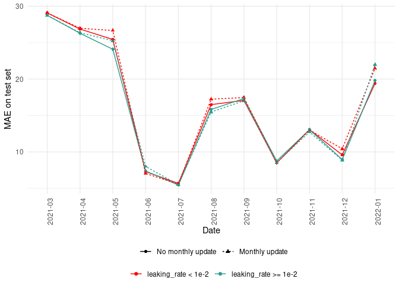

High dimension reservoir
================

<link href="results_high_dim_rc_files/libs/lightable-0.0.1/lightable.css" rel="stylesheet" />

# Introduction

# Methods

## Use case

## Reservoir computing

## Genetic algorithm

## Experimental setup

### Metaparameter exploration

Choice of hyperparameters :

sigma leaking rate : because depending on setting, convergence to
different leaking rate seem to occur. Furthermore, low leaking rate
seemed to achieve better performance

pmutCat : because hyperparameter monthly update seem not to improve
performance which is counterintuitive as important features should
evolve in this context of non stationary time series.

Grid :

- sigma leaking rate = c(0.016, 0.04, 0.1, 0.25)
- pmutCat = c(0.1, 0.2, 0.4, 0.8)

# Results

## Data presentation

# Setting

Figure above describes the evolution of 4 features (RT-PCR, positive
RT-PCR, IPTCC and hospitalization) and of the outcome. We observe that
the relationship between explanatory features and the outcome evolves
over time making this problem complex.

## Forecast

### Sanity check

First, we check that there is 40 reservoir prediction for each day of
the prediction for each scenario. We observe that there is indeed a
forecast for each day. Some days have less than 40 reservoirs but the
minimum is 37 which seems acceptable.

### Performance

<table class="table" style="margin-left: auto; margin-right: auto;">
<caption>Model performance</caption>
 <thead>
  <tr>
   <th style="text-align:right;"> pmutCat </th>
   <th style="text-align:right;"> lr_sigma </th>
   <th style="text-align:left;"> update </th>
   <th style="text-align:left;"> MAE </th>
   <th style="text-align:left;"> MRE </th>
   <th style="text-align:left;"> MAEB </th>
   <th style="text-align:left;"> MREB </th>
  </tr>
 </thead>
<tbody>
  <tr>
   <td style="text-align:right;"> 0.02 </td>
   <td style="text-align:right;"> 0.1 </td>
   <td style="text-align:left;"> No monthly update </td>
   <td style="text-align:left;"> 15.93(±13.38) </td>
   <td style="text-align:left;"> 0.28(±0.35) </td>
   <td style="text-align:left;"> -2.65(±5.74) </td>
   <td style="text-align:left;"> 0.9(±1.59) </td>
  </tr>
  <tr>
   <td style="text-align:right;"> 0.02 </td>
   <td style="text-align:right;"> 0.1 </td>
   <td style="text-align:left;"> Monthly update </td>
   <td style="text-align:left;"> 15.77(±13.14) </td>
   <td style="text-align:left;"> 0.27(±0.35) </td>
   <td style="text-align:left;"> -2.82(±5.05) </td>
   <td style="text-align:left;"> 0.87(±1.06) </td>
  </tr>
  <tr>
   <td style="text-align:right;"> 0.02 </td>
   <td style="text-align:right;"> 0.2 </td>
   <td style="text-align:left;"> No monthly update </td>
   <td style="text-align:left;"> 15.51(±12.87) </td>
   <td style="text-align:left;"> 0.27(±0.34) </td>
   <td style="text-align:left;"> -3.08(±5.82) </td>
   <td style="text-align:left;"> 0.88(±1.56) </td>
  </tr>
  <tr>
   <td style="text-align:right;"> 0.02 </td>
   <td style="text-align:right;"> 0.2 </td>
   <td style="text-align:left;"> Monthly update </td>
   <td style="text-align:left;"> 15.69(±12.54) </td>
   <td style="text-align:left;"> 0.27(±0.33) </td>
   <td style="text-align:left;"> -2.9(±5.79) </td>
   <td style="text-align:left;"> 0.85(±1.52) </td>
  </tr>
  <tr>
   <td style="text-align:right;"> 0.02 </td>
   <td style="text-align:right;"> 0.4 </td>
   <td style="text-align:left;"> No monthly update </td>
   <td style="text-align:left;"> 14.89(±12.14) </td>
   <td style="text-align:left;"> 0.26(±0.3) </td>
   <td style="text-align:left;"> -3.7(±7.36) </td>
   <td style="text-align:left;"> 0.84(±2.16) </td>
  </tr>
  <tr>
   <td style="text-align:right;"> 0.02 </td>
   <td style="text-align:right;"> 0.4 </td>
   <td style="text-align:left;"> Monthly update </td>
   <td style="text-align:left;"> 15.27(±13.11) </td>
   <td style="text-align:left;"> 0.26(±0.34) </td>
   <td style="text-align:left;"> -3.32(±5.8) </td>
   <td style="text-align:left;"> 0.88(±1.4) </td>
  </tr>
  <tr>
   <td style="text-align:right;"> 0.02 </td>
   <td style="text-align:right;"> 0.8 </td>
   <td style="text-align:left;"> No monthly update </td>
   <td style="text-align:left;"> 15.26(±12.94) </td>
   <td style="text-align:left;"> 0.25(±0.31) </td>
   <td style="text-align:left;"> -3.33(±7.88) </td>
   <td style="text-align:left;"> 0.84(±1.83) </td>
  </tr>
  <tr>
   <td style="text-align:right;"> 0.02 </td>
   <td style="text-align:right;"> 0.8 </td>
   <td style="text-align:left;"> Monthly update </td>
   <td style="text-align:left;"> 15.24(±13.02) </td>
   <td style="text-align:left;"> 0.26(±0.34) </td>
   <td style="text-align:left;"> -3.34(±7.14) </td>
   <td style="text-align:left;"> 0.87(±1.79) </td>
  </tr>
  <tr>
   <td style="text-align:right;"> 0.04 </td>
   <td style="text-align:right;"> 0.1 </td>
   <td style="text-align:left;"> No monthly update </td>
   <td style="text-align:left;"> 15.82(±13.1) </td>
   <td style="text-align:left;"> 0.27(±0.35) </td>
   <td style="text-align:left;"> -2.76(±5.86) </td>
   <td style="text-align:left;"> 0.9(±1.13) </td>
  </tr>
  <tr>
   <td style="text-align:right;"> 0.04 </td>
   <td style="text-align:right;"> 0.1 </td>
   <td style="text-align:left;"> Monthly update </td>
   <td style="text-align:left;"> 15.96(±13.24) </td>
   <td style="text-align:left;"> 0.27(±0.36) </td>
   <td style="text-align:left;"> -2.63(±5.34) </td>
   <td style="text-align:left;"> 0.89(±1.06) </td>
  </tr>
  <tr>
   <td style="text-align:right;"> 0.04 </td>
   <td style="text-align:right;"> 0.2 </td>
   <td style="text-align:left;"> No monthly update </td>
   <td style="text-align:left;"> 15.75(±12.97) </td>
   <td style="text-align:left;"> 0.28(±0.36) </td>
   <td style="text-align:left;"> -2.84(±5.67) </td>
   <td style="text-align:left;"> 0.89(±1.61) </td>
  </tr>
  <tr>
   <td style="text-align:right;"> 0.04 </td>
   <td style="text-align:right;"> 0.2 </td>
   <td style="text-align:left;"> Monthly update </td>
   <td style="text-align:left;"> 15.67(±13.17) </td>
   <td style="text-align:left;"> 0.26(±0.36) </td>
   <td style="text-align:left;"> -2.91(±5.07) </td>
   <td style="text-align:left;"> 0.89(±1.23) </td>
  </tr>
  <tr>
   <td style="text-align:right;"> 0.04 </td>
   <td style="text-align:right;"> 0.4 </td>
   <td style="text-align:left;"> No monthly update </td>
   <td style="text-align:left;"> 15.32(±12.73) </td>
   <td style="text-align:left;"> 0.27(±0.32) </td>
   <td style="text-align:left;"> -3.27(±6.5) </td>
   <td style="text-align:left;"> 0.81(±1.65) </td>
  </tr>
  <tr>
   <td style="text-align:right;"> 0.04 </td>
   <td style="text-align:right;"> 0.4 </td>
   <td style="text-align:left;"> Monthly update </td>
   <td style="text-align:left;"> 15.14(±12.89) </td>
   <td style="text-align:left;"> 0.27(±0.34) </td>
   <td style="text-align:left;"> -3.45(±5.8) </td>
   <td style="text-align:left;"> 0.86(±1.55) </td>
  </tr>
  <tr>
   <td style="text-align:right;"> 0.04 </td>
   <td style="text-align:right;"> 0.8 </td>
   <td style="text-align:left;"> No monthly update </td>
   <td style="text-align:left;"> 14.99(±12.23) </td>
   <td style="text-align:left;"> 0.25(±0.33) </td>
   <td style="text-align:left;"> -3.6(±7.4) </td>
   <td style="text-align:left;"> 0.82(±1.29) </td>
  </tr>
  <tr>
   <td style="text-align:right;"> 0.04 </td>
   <td style="text-align:right;"> 0.8 </td>
   <td style="text-align:left;"> Monthly update </td>
   <td style="text-align:left;"> 15.14(±12.75) </td>
   <td style="text-align:left;"> 0.28(±0.34) </td>
   <td style="text-align:left;"> -3.44(±6.18) </td>
   <td style="text-align:left;"> 0.86(±1.68) </td>
  </tr>
  <tr>
   <td style="text-align:right;"> 0.10 </td>
   <td style="text-align:right;"> 0.1 </td>
   <td style="text-align:left;"> No monthly update </td>
   <td style="text-align:left;"> 15.45(±12.94) </td>
   <td style="text-align:left;"> 0.26(±0.35) </td>
   <td style="text-align:left;"> -3.13(±6.01) </td>
   <td style="text-align:left;"> 0.86(±1.62) </td>
  </tr>
  <tr>
   <td style="text-align:right;"> 0.10 </td>
   <td style="text-align:right;"> 0.1 </td>
   <td style="text-align:left;"> Monthly update </td>
   <td style="text-align:left;"> 15.76(±13.31) </td>
   <td style="text-align:left;"> 0.27(±0.35) </td>
   <td style="text-align:left;"> -2.82(±5.51) </td>
   <td style="text-align:left;"> 0.89(±1.45) </td>
  </tr>
  <tr>
   <td style="text-align:right;"> 0.10 </td>
   <td style="text-align:right;"> 0.2 </td>
   <td style="text-align:left;"> No monthly update </td>
   <td style="text-align:left;"> 15.57(±13.06) </td>
   <td style="text-align:left;"> 0.26(±0.35) </td>
   <td style="text-align:left;"> -3.02(±6.21) </td>
   <td style="text-align:left;"> 0.89(±1.13) </td>
  </tr>
  <tr>
   <td style="text-align:right;"> 0.10 </td>
   <td style="text-align:right;"> 0.2 </td>
   <td style="text-align:left;"> Monthly update </td>
   <td style="text-align:left;"> 15.66(±13.05) </td>
   <td style="text-align:left;"> 0.28(±0.34) </td>
   <td style="text-align:left;"> -2.93(±5.38) </td>
   <td style="text-align:left;"> 0.89(±1.67) </td>
  </tr>
  <tr>
   <td style="text-align:right;"> 0.10 </td>
   <td style="text-align:right;"> 0.4 </td>
   <td style="text-align:left;"> No monthly update </td>
   <td style="text-align:left;"> 15.62(±12.69) </td>
   <td style="text-align:left;"> 0.27(±0.34) </td>
   <td style="text-align:left;"> -2.97(±5.84) </td>
   <td style="text-align:left;"> 0.87(±1.56) </td>
  </tr>
  <tr>
   <td style="text-align:right;"> 0.10 </td>
   <td style="text-align:right;"> 0.4 </td>
   <td style="text-align:left;"> Monthly update </td>
   <td style="text-align:left;"> 15.6(±13.2) </td>
   <td style="text-align:left;"> 0.27(±0.35) </td>
   <td style="text-align:left;"> -2.99(±5.5) </td>
   <td style="text-align:left;"> 0.88(±1.36) </td>
  </tr>
  <tr>
   <td style="text-align:right;"> 0.10 </td>
   <td style="text-align:right;"> 0.8 </td>
   <td style="text-align:left;"> No monthly update </td>
   <td style="text-align:left;"> 14.94(±12.43) </td>
   <td style="text-align:left;"> 0.26(±0.33) </td>
   <td style="text-align:left;"> -3.65(±6.71) </td>
   <td style="text-align:left;"> 0.82(±1.64) </td>
  </tr>
  <tr>
   <td style="text-align:right;"> 0.10 </td>
   <td style="text-align:right;"> 0.8 </td>
   <td style="text-align:left;"> Monthly update </td>
   <td style="text-align:left;"> 15.69(±12.99) </td>
   <td style="text-align:left;"> 0.27(±0.35) </td>
   <td style="text-align:left;"> -2.9(±5.41) </td>
   <td style="text-align:left;"> 0.89(±1.37) </td>
  </tr>
  <tr>
   <td style="text-align:right;"> 0.25 </td>
   <td style="text-align:right;"> 0.1 </td>
   <td style="text-align:left;"> No monthly update </td>
   <td style="text-align:left;"> 15.14(±12.8) </td>
   <td style="text-align:left;"> 0.28(±0.34) </td>
   <td style="text-align:left;"> -3.45(±6.33) </td>
   <td style="text-align:left;"> 0.85(±1.71) </td>
  </tr>
  <tr>
   <td style="text-align:right;"> 0.25 </td>
   <td style="text-align:right;"> 0.1 </td>
   <td style="text-align:left;"> Monthly update </td>
   <td style="text-align:left;"> 14.85(±12.67) </td>
   <td style="text-align:left;"> 0.25(±0.33) </td>
   <td style="text-align:left;"> -3.73(±5.97) </td>
   <td style="text-align:left;"> 0.84(±1.17) </td>
  </tr>
  <tr>
   <td style="text-align:right;"> 0.25 </td>
   <td style="text-align:right;"> 0.2 </td>
   <td style="text-align:left;"> No monthly update </td>
   <td style="text-align:left;"> 15.58(±13.11) </td>
   <td style="text-align:left;"> 0.26(±0.34) </td>
   <td style="text-align:left;"> -3.01(±6) </td>
   <td style="text-align:left;"> 0.86(±1.59) </td>
  </tr>
  <tr>
   <td style="text-align:right;"> 0.25 </td>
   <td style="text-align:right;"> 0.2 </td>
   <td style="text-align:left;"> Monthly update </td>
   <td style="text-align:left;"> 15.16(±12.69) </td>
   <td style="text-align:left;"> 0.27(±0.33) </td>
   <td style="text-align:left;"> -3.42(±5.9) </td>
   <td style="text-align:left;"> 0.85(±1.34) </td>
  </tr>
  <tr>
   <td style="text-align:right;"> 0.25 </td>
   <td style="text-align:right;"> 0.4 </td>
   <td style="text-align:left;"> No monthly update </td>
   <td style="text-align:left;"> 15.2(±12.85) </td>
   <td style="text-align:left;"> 0.27(±0.34) </td>
   <td style="text-align:left;"> -3.39(±7.27) </td>
   <td style="text-align:left;"> 0.84(±1.44) </td>
  </tr>
  <tr>
   <td style="text-align:right;"> 0.25 </td>
   <td style="text-align:right;"> 0.4 </td>
   <td style="text-align:left;"> Monthly update </td>
   <td style="text-align:left;"> 15.21(±13.21) </td>
   <td style="text-align:left;"> 0.27(±0.33) </td>
   <td style="text-align:left;"> -3.37(±5.68) </td>
   <td style="text-align:left;"> 0.86(±1.44) </td>
  </tr>
  <tr>
   <td style="text-align:right;"> 0.25 </td>
   <td style="text-align:right;"> 0.8 </td>
   <td style="text-align:left;"> No monthly update </td>
   <td style="text-align:left;"> 15.45(±13.07) </td>
   <td style="text-align:left;"> 0.26(±0.35) </td>
   <td style="text-align:left;"> -3.14(±6.32) </td>
   <td style="text-align:left;"> 0.85(±1.12) </td>
  </tr>
  <tr>
   <td style="text-align:right;"> 0.25 </td>
   <td style="text-align:right;"> 0.8 </td>
   <td style="text-align:left;"> Monthly update </td>
   <td style="text-align:left;"> 15.5(±13) </td>
   <td style="text-align:left;"> 0.27(±0.34) </td>
   <td style="text-align:left;"> -3.09(±5.34) </td>
   <td style="text-align:left;"> 0.86(±1.19) </td>
  </tr>
</tbody>
</table>

# Hyperparameters

## Numeric hyperparameters

### Sanity check

### Performance on train set

### Hyperparameter evolution

### Leaking rate influence

<table class="table" style="margin-left: auto; margin-right: auto;">
<caption>Model performance</caption>
 <thead>
  <tr>
   <th style="text-align:left;"> lr_inf_2 </th>
   <th style="text-align:left;"> update </th>
   <th style="text-align:left;"> MAE </th>
   <th style="text-align:left;"> MRE </th>
   <th style="text-align:left;"> MAEB </th>
   <th style="text-align:left;"> MREB </th>
  </tr>
 </thead>
<tbody>
  <tr>
   <td style="text-align:left;"> leaking_rate &lt; 1e-2 </td>
   <td style="text-align:left;"> No monthly update </td>
   <td style="text-align:left;"> 15.48(±12.79) </td>
   <td style="text-align:left;"> 0.25(±0.34) </td>
   <td style="text-align:left;"> -3.1(±5.97) </td>
   <td style="text-align:left;"> 0.86(±1.64) </td>
  </tr>
  <tr>
   <td style="text-align:left;"> leaking_rate &lt; 1e-2 </td>
   <td style="text-align:left;"> Monthly update </td>
   <td style="text-align:left;"> 15.88(±12.76) </td>
   <td style="text-align:left;"> 0.27(±0.34) </td>
   <td style="text-align:left;"> -2.7(±5.67) </td>
   <td style="text-align:left;"> 0.88(±1.56) </td>
  </tr>
  <tr>
   <td style="text-align:left;"> leaking_rate &gt;= 1e-2 </td>
   <td style="text-align:left;"> No monthly update </td>
   <td style="text-align:left;"> 15.21(±12.86) </td>
   <td style="text-align:left;"> 0.26(±0.34) </td>
   <td style="text-align:left;"> -3.37(±6.01) </td>
   <td style="text-align:left;"> 0.84(±1.14) </td>
  </tr>
  <tr>
   <td style="text-align:left;"> leaking_rate &gt;= 1e-2 </td>
   <td style="text-align:left;"> Monthly update </td>
   <td style="text-align:left;"> 15.4(±13.04) </td>
   <td style="text-align:left;"> 0.27(±0.34) </td>
   <td style="text-align:left;"> -3.19(±5.42) </td>
   <td style="text-align:left;"> 0.87(±1.28) </td>
  </tr>
</tbody>
</table>

## Categorical hyperparameters

