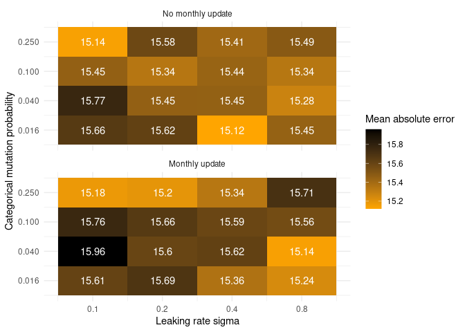
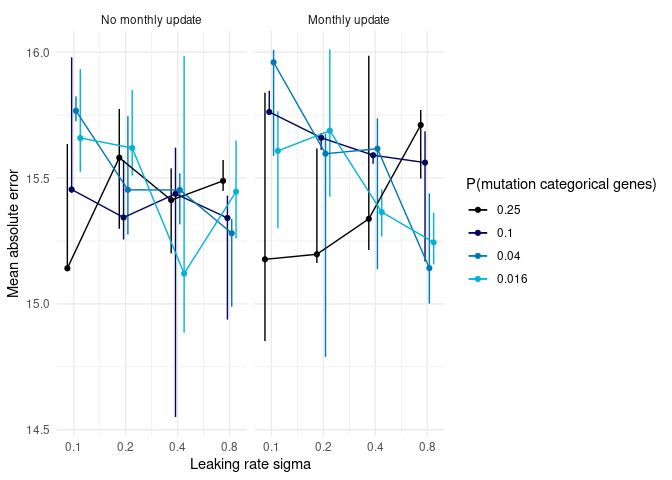
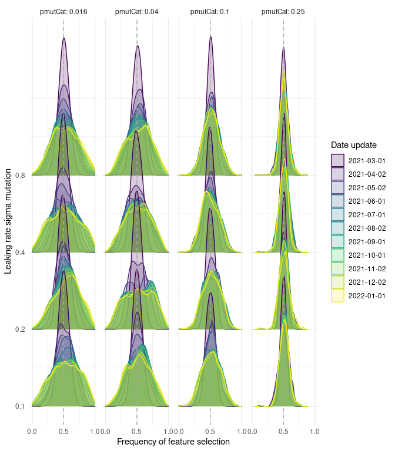

High dimension reservoir
================

<link href="results_high_dim_rc_files/libs/lightable-0.0.1/lightable.css" rel="stylesheet" />

# Introduction

# Methods

## Use case

## Reservoir computing

## Genetic algorithm

## Experimental setup

### Metaparameter exploration

Choice of hyperparameters :

sigma leaking rate : because depending on setting, convergence to
different leaking rate seem to occur. Furthermore, low leaking rate
seemed to achieve better performance

pmutCat : because hyperparameter monthly update seem not to improve
performance which is counterintuitive as important features should
evolve in this context of non stationary time series.

Grid :

- sigma leaking rate = c(0.016, 0.04, 0.1, 0.25)
- pmutCat = c(0.1, 0.2, 0.4, 0.8)

# Results

## Data presentation

# Setting

Figure above describes the evolution of 4 features (RT-PCR, positive
RT-PCR, IPTCC and hospitalization) and of the outcome. We observe that
the relationship between explanatory features and the outcome evolves
over time making this problem complex.

## Forecast

### Sanity check

First, we check that there is 40 reservoir prediction for each day of
the prediction for each scenario. We observe that there is indeed a
forecast for each day. Some days have less than 40 reservoirs but the
minimum is 37 which seems acceptable.

### Performance

<table class="table" style="margin-left: auto; margin-right: auto;">
<caption>Model performance</caption>
 <thead>
  <tr>
   <th style="text-align:right;"> pmutCat </th>
   <th style="text-align:right;"> lr_sigma </th>
   <th style="text-align:left;"> update </th>
   <th style="text-align:left;"> MAE </th>
   <th style="text-align:left;"> MRE </th>
   <th style="text-align:left;"> MAEB </th>
   <th style="text-align:left;"> MREB </th>
  </tr>
 </thead>
<tbody>
  <tr>
   <td style="text-align:right;"> 0.02 </td>
   <td style="text-align:right;"> 0.1 </td>
   <td style="text-align:left;"> No monthly update </td>
   <td style="text-align:left;"> 15.93(\pm13.38) </td>
   <td style="text-align:left;"> 0.28(\pm0.35) </td>
   <td style="text-align:left;"> -2.65(\pm5.74) </td>
   <td style="text-align:left;"> 0.9(\pm1.59) </td>
  </tr>
  <tr>
   <td style="text-align:right;"> 0.02 </td>
   <td style="text-align:right;"> 0.1 </td>
   <td style="text-align:left;"> Monthly update </td>
   <td style="text-align:left;"> 15.77(\pm13.14) </td>
   <td style="text-align:left;"> 0.27(\pm0.35) </td>
   <td style="text-align:left;"> -2.82(\pm5.05) </td>
   <td style="text-align:left;"> 0.87(\pm1.06) </td>
  </tr>
  <tr>
   <td style="text-align:right;"> 0.02 </td>
   <td style="text-align:right;"> 0.2 </td>
   <td style="text-align:left;"> No monthly update </td>
   <td style="text-align:left;"> 15.51(\pm12.87) </td>
   <td style="text-align:left;"> 0.27(\pm0.34) </td>
   <td style="text-align:left;"> -3.08(\pm5.82) </td>
   <td style="text-align:left;"> 0.88(\pm1.56) </td>
  </tr>
  <tr>
   <td style="text-align:right;"> 0.02 </td>
   <td style="text-align:right;"> 0.2 </td>
   <td style="text-align:left;"> Monthly update </td>
   <td style="text-align:left;"> 15.69(\pm12.54) </td>
   <td style="text-align:left;"> 0.27(\pm0.33) </td>
   <td style="text-align:left;"> -2.9(\pm5.79) </td>
   <td style="text-align:left;"> 0.85(\pm1.52) </td>
  </tr>
  <tr>
   <td style="text-align:right;"> 0.02 </td>
   <td style="text-align:right;"> 0.4 </td>
   <td style="text-align:left;"> No monthly update </td>
   <td style="text-align:left;"> 14.89(\pm12.14) </td>
   <td style="text-align:left;"> 0.26(\pm0.3) </td>
   <td style="text-align:left;"> -3.7(\pm7.36) </td>
   <td style="text-align:left;"> 0.84(\pm2.16) </td>
  </tr>
  <tr>
   <td style="text-align:right;"> 0.02 </td>
   <td style="text-align:right;"> 0.4 </td>
   <td style="text-align:left;"> Monthly update </td>
   <td style="text-align:left;"> 15.27(\pm13.11) </td>
   <td style="text-align:left;"> 0.26(\pm0.34) </td>
   <td style="text-align:left;"> -3.32(\pm5.8) </td>
   <td style="text-align:left;"> 0.88(\pm1.4) </td>
  </tr>
  <tr>
   <td style="text-align:right;"> 0.02 </td>
   <td style="text-align:right;"> 0.8 </td>
   <td style="text-align:left;"> No monthly update </td>
   <td style="text-align:left;"> 15.26(\pm12.94) </td>
   <td style="text-align:left;"> 0.25(\pm0.31) </td>
   <td style="text-align:left;"> -3.33(\pm7.88) </td>
   <td style="text-align:left;"> 0.84(\pm1.83) </td>
  </tr>
  <tr>
   <td style="text-align:right;"> 0.02 </td>
   <td style="text-align:right;"> 0.8 </td>
   <td style="text-align:left;"> Monthly update </td>
   <td style="text-align:left;"> 15.24(\pm13.02) </td>
   <td style="text-align:left;"> 0.26(\pm0.34) </td>
   <td style="text-align:left;"> -3.34(\pm7.14) </td>
   <td style="text-align:left;"> 0.87(\pm1.79) </td>
  </tr>
  <tr>
   <td style="text-align:right;"> 0.04 </td>
   <td style="text-align:right;"> 0.1 </td>
   <td style="text-align:left;"> No monthly update </td>
   <td style="text-align:left;"> 15.82(\pm13.1) </td>
   <td style="text-align:left;"> 0.27(\pm0.35) </td>
   <td style="text-align:left;"> -2.76(\pm5.86) </td>
   <td style="text-align:left;"> 0.9(\pm1.13) </td>
  </tr>
  <tr>
   <td style="text-align:right;"> 0.04 </td>
   <td style="text-align:right;"> 0.1 </td>
   <td style="text-align:left;"> Monthly update </td>
   <td style="text-align:left;"> 15.96(\pm13.24) </td>
   <td style="text-align:left;"> 0.27(\pm0.36) </td>
   <td style="text-align:left;"> -2.63(\pm5.34) </td>
   <td style="text-align:left;"> 0.89(\pm1.06) </td>
  </tr>
  <tr>
   <td style="text-align:right;"> 0.04 </td>
   <td style="text-align:right;"> 0.2 </td>
   <td style="text-align:left;"> No monthly update </td>
   <td style="text-align:left;"> 15.75(\pm12.97) </td>
   <td style="text-align:left;"> 0.28(\pm0.36) </td>
   <td style="text-align:left;"> -2.84(\pm5.67) </td>
   <td style="text-align:left;"> 0.89(\pm1.61) </td>
  </tr>
  <tr>
   <td style="text-align:right;"> 0.04 </td>
   <td style="text-align:right;"> 0.2 </td>
   <td style="text-align:left;"> Monthly update </td>
   <td style="text-align:left;"> 15.67(\pm13.17) </td>
   <td style="text-align:left;"> 0.26(\pm0.36) </td>
   <td style="text-align:left;"> -2.91(\pm5.07) </td>
   <td style="text-align:left;"> 0.89(\pm1.23) </td>
  </tr>
  <tr>
   <td style="text-align:right;"> 0.04 </td>
   <td style="text-align:right;"> 0.4 </td>
   <td style="text-align:left;"> No monthly update </td>
   <td style="text-align:left;"> 15.32(\pm12.73) </td>
   <td style="text-align:left;"> 0.27(\pm0.32) </td>
   <td style="text-align:left;"> -3.27(\pm6.5) </td>
   <td style="text-align:left;"> 0.81(\pm1.65) </td>
  </tr>
  <tr>
   <td style="text-align:right;"> 0.04 </td>
   <td style="text-align:right;"> 0.4 </td>
   <td style="text-align:left;"> Monthly update </td>
   <td style="text-align:left;"> 15.14(\pm12.89) </td>
   <td style="text-align:left;"> 0.27(\pm0.34) </td>
   <td style="text-align:left;"> -3.45(\pm5.8) </td>
   <td style="text-align:left;"> 0.86(\pm1.55) </td>
  </tr>
  <tr>
   <td style="text-align:right;"> 0.04 </td>
   <td style="text-align:right;"> 0.8 </td>
   <td style="text-align:left;"> No monthly update </td>
   <td style="text-align:left;"> 14.99(\pm12.23) </td>
   <td style="text-align:left;"> 0.25(\pm0.33) </td>
   <td style="text-align:left;"> -3.6(\pm7.4) </td>
   <td style="text-align:left;"> 0.82(\pm1.29) </td>
  </tr>
  <tr>
   <td style="text-align:right;"> 0.04 </td>
   <td style="text-align:right;"> 0.8 </td>
   <td style="text-align:left;"> Monthly update </td>
   <td style="text-align:left;"> 15.14(\pm12.75) </td>
   <td style="text-align:left;"> 0.28(\pm0.34) </td>
   <td style="text-align:left;"> -3.44(\pm6.18) </td>
   <td style="text-align:left;"> 0.86(\pm1.68) </td>
  </tr>
  <tr>
   <td style="text-align:right;"> 0.10 </td>
   <td style="text-align:right;"> 0.1 </td>
   <td style="text-align:left;"> No monthly update </td>
   <td style="text-align:left;"> 15.45(\pm12.94) </td>
   <td style="text-align:left;"> 0.26(\pm0.35) </td>
   <td style="text-align:left;"> -3.13(\pm6.01) </td>
   <td style="text-align:left;"> 0.86(\pm1.62) </td>
  </tr>
  <tr>
   <td style="text-align:right;"> 0.10 </td>
   <td style="text-align:right;"> 0.1 </td>
   <td style="text-align:left;"> Monthly update </td>
   <td style="text-align:left;"> 15.76(\pm13.31) </td>
   <td style="text-align:left;"> 0.27(\pm0.35) </td>
   <td style="text-align:left;"> -2.82(\pm5.51) </td>
   <td style="text-align:left;"> 0.89(\pm1.45) </td>
  </tr>
  <tr>
   <td style="text-align:right;"> 0.10 </td>
   <td style="text-align:right;"> 0.2 </td>
   <td style="text-align:left;"> No monthly update </td>
   <td style="text-align:left;"> 15.57(\pm13.06) </td>
   <td style="text-align:left;"> 0.26(\pm0.35) </td>
   <td style="text-align:left;"> -3.02(\pm6.21) </td>
   <td style="text-align:left;"> 0.89(\pm1.13) </td>
  </tr>
  <tr>
   <td style="text-align:right;"> 0.10 </td>
   <td style="text-align:right;"> 0.2 </td>
   <td style="text-align:left;"> Monthly update </td>
   <td style="text-align:left;"> 15.66(\pm13.05) </td>
   <td style="text-align:left;"> 0.28(\pm0.34) </td>
   <td style="text-align:left;"> -2.93(\pm5.38) </td>
   <td style="text-align:left;"> 0.89(\pm1.67) </td>
  </tr>
  <tr>
   <td style="text-align:right;"> 0.10 </td>
   <td style="text-align:right;"> 0.4 </td>
   <td style="text-align:left;"> No monthly update </td>
   <td style="text-align:left;"> 15.62(\pm12.69) </td>
   <td style="text-align:left;"> 0.27(\pm0.34) </td>
   <td style="text-align:left;"> -2.97(\pm5.84) </td>
   <td style="text-align:left;"> 0.87(\pm1.56) </td>
  </tr>
  <tr>
   <td style="text-align:right;"> 0.10 </td>
   <td style="text-align:right;"> 0.4 </td>
   <td style="text-align:left;"> Monthly update </td>
   <td style="text-align:left;"> 15.6(\pm13.2) </td>
   <td style="text-align:left;"> 0.27(\pm0.35) </td>
   <td style="text-align:left;"> -2.99(\pm5.5) </td>
   <td style="text-align:left;"> 0.88(\pm1.36) </td>
  </tr>
  <tr>
   <td style="text-align:right;"> 0.10 </td>
   <td style="text-align:right;"> 0.8 </td>
   <td style="text-align:left;"> No monthly update </td>
   <td style="text-align:left;"> 14.94(\pm12.43) </td>
   <td style="text-align:left;"> 0.26(\pm0.33) </td>
   <td style="text-align:left;"> -3.65(\pm6.71) </td>
   <td style="text-align:left;"> 0.82(\pm1.64) </td>
  </tr>
  <tr>
   <td style="text-align:right;"> 0.10 </td>
   <td style="text-align:right;"> 0.8 </td>
   <td style="text-align:left;"> Monthly update </td>
   <td style="text-align:left;"> 15.69(\pm12.99) </td>
   <td style="text-align:left;"> 0.27(\pm0.35) </td>
   <td style="text-align:left;"> -2.9(\pm5.41) </td>
   <td style="text-align:left;"> 0.89(\pm1.37) </td>
  </tr>
  <tr>
   <td style="text-align:right;"> 0.25 </td>
   <td style="text-align:right;"> 0.1 </td>
   <td style="text-align:left;"> No monthly update </td>
   <td style="text-align:left;"> 15.14(\pm12.8) </td>
   <td style="text-align:left;"> 0.28(\pm0.34) </td>
   <td style="text-align:left;"> -3.45(\pm6.33) </td>
   <td style="text-align:left;"> 0.85(\pm1.71) </td>
  </tr>
  <tr>
   <td style="text-align:right;"> 0.25 </td>
   <td style="text-align:right;"> 0.1 </td>
   <td style="text-align:left;"> Monthly update </td>
   <td style="text-align:left;"> 14.85(\pm12.67) </td>
   <td style="text-align:left;"> 0.25(\pm0.33) </td>
   <td style="text-align:left;"> -3.73(\pm5.97) </td>
   <td style="text-align:left;"> 0.84(\pm1.17) </td>
  </tr>
  <tr>
   <td style="text-align:right;"> 0.25 </td>
   <td style="text-align:right;"> 0.2 </td>
   <td style="text-align:left;"> No monthly update </td>
   <td style="text-align:left;"> 15.58(\pm13.11) </td>
   <td style="text-align:left;"> 0.26(\pm0.34) </td>
   <td style="text-align:left;"> -3.01(\pm6) </td>
   <td style="text-align:left;"> 0.86(\pm1.59) </td>
  </tr>
  <tr>
   <td style="text-align:right;"> 0.25 </td>
   <td style="text-align:right;"> 0.2 </td>
   <td style="text-align:left;"> Monthly update </td>
   <td style="text-align:left;"> 15.16(\pm12.69) </td>
   <td style="text-align:left;"> 0.27(\pm0.33) </td>
   <td style="text-align:left;"> -3.42(\pm5.9) </td>
   <td style="text-align:left;"> 0.85(\pm1.34) </td>
  </tr>
  <tr>
   <td style="text-align:right;"> 0.25 </td>
   <td style="text-align:right;"> 0.4 </td>
   <td style="text-align:left;"> No monthly update </td>
   <td style="text-align:left;"> 15.2(\pm12.85) </td>
   <td style="text-align:left;"> 0.27(\pm0.34) </td>
   <td style="text-align:left;"> -3.39(\pm7.27) </td>
   <td style="text-align:left;"> 0.84(\pm1.44) </td>
  </tr>
  <tr>
   <td style="text-align:right;"> 0.25 </td>
   <td style="text-align:right;"> 0.4 </td>
   <td style="text-align:left;"> Monthly update </td>
   <td style="text-align:left;"> 15.21(\pm13.21) </td>
   <td style="text-align:left;"> 0.27(\pm0.33) </td>
   <td style="text-align:left;"> -3.37(\pm5.68) </td>
   <td style="text-align:left;"> 0.86(\pm1.44) </td>
  </tr>
  <tr>
   <td style="text-align:right;"> 0.25 </td>
   <td style="text-align:right;"> 0.8 </td>
   <td style="text-align:left;"> No monthly update </td>
   <td style="text-align:left;"> 15.45(\pm13.07) </td>
   <td style="text-align:left;"> 0.26(\pm0.35) </td>
   <td style="text-align:left;"> -3.14(\pm6.32) </td>
   <td style="text-align:left;"> 0.85(\pm1.12) </td>
  </tr>
  <tr>
   <td style="text-align:right;"> 0.25 </td>
   <td style="text-align:right;"> 0.8 </td>
   <td style="text-align:left;"> Monthly update </td>
   <td style="text-align:left;"> 15.5(\pm13) </td>
   <td style="text-align:left;"> 0.27(\pm0.34) </td>
   <td style="text-align:left;"> -3.09(\pm5.34) </td>
   <td style="text-align:left;"> 0.86(\pm1.19) </td>
  </tr>
</tbody>
</table>

# Hyperparameters

## Numeric hyperparameters

## Categorical hyperparameters

