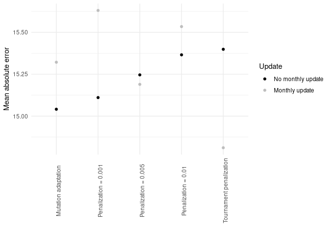

# High dimension reservoir

<link href="results_high_dim_rc_exp2_files/libs/lightable-0.0.1/lightable.css" rel="stylesheet" />

# Introduction

# Methods

## Use case

## Reservoir computing

## Genetic algorithm

## Experimental setup

### Penalization exploration

We explored to variant of the GA optimizing both the number of features
and the MAE :

1)  We changed the fitness function from $MAE$ to
    $MAE + \theta * nbfeatures$. In this case, $\theta$ is a penalty
    term penalizing genetic individuals selecting many features. We
    explore $\theta \in \{1e^{-3}, 5*1e^{-3}, 1e^{-2})$.
2)  We changed the tournament selection. When selecting new parents, we
    perform a three individuals tournament (instead of two), then we
    exclude the individual with the larger number of features and then
    we select the individual with the lowest $MAE$
3)  Finally, we explored an epidemiology guided feature selection where
    we keep the original GA but we only provide 11 features guided by
    expert knowledge.

# Results

## Forecast

### Sanity check

First, we check that there is 40 reservoir prediction for each day of
the prediction for each scenario. We observe that there is indeed a
forecast for each day. Some days have less than 40 reservoirs but the
minimum is 39 which seems acceptable.

### Performance

| model | update | MAE | MRE | MAEB | MREB |
|:---|:---|:---|:---|:---|:---|
| Epidemio | No monthly update | 15.4(±13.1) | 0.27(±0.33) | -3.18(±6.59) | 0.85(±1.74) |
| Epidemio | Monthly update | 15.23(±13.78) | 0.24(±0.35) | -3.35(±8.58) | 0.84(±2.1) |
| Mutation adaptation | No monthly update | 15.04(±12.02) | 0.25(±0.33) | -3.55(±6.94) | 0.85(±1.47) |
| Mutation adaptation | Monthly update | 15.32(±12.99) | 0.25(±0.35) | -3.27(±6.66) | 0.86(±1.34) |
| Penalization = 0.001 | No monthly update | 15.11(±13.08) | 0.25(±0.35) | -3.48(±6.66) | 0.84(±0.84) |
| Penalization = 0.001 | Monthly update | 15.63(±13.26) | 0.28(±0.36) | -2.96(±5.91) | 0.86(±1.61) |
| Penalization = 0.005 | No monthly update | 15.25(±12.75) | 0.26(±0.32) | -3.34(±6.88) | 0.84(±1.74) |
| Penalization = 0.005 | Monthly update | 15.19(±12.84) | 0.27(±0.34) | -3.4(±5.78) | 0.84(±0.99) |
| Penalization = 0.01 | No monthly update | 15.37(±12.84) | 0.26(±0.34) | -3.22(±6.29) | 0.87(±1.42) |
| Penalization = 0.01 | Monthly update | 15.53(±12.92) | 0.26(±0.35) | -3.05(±5.74) | 0.87(±1.07) |
| Tournament penalization | No monthly update | 14.39(±12.71) | 0.26(±0.34) | -3.14(±6.2) | 0.85(±1.29) |
| Tournament penalization | Monthly update | 14.53(±12.84) | 0.29(±0.36) | -3(±5.87) | 0.87(±1.02) |

Model performance

# Hyperparameters

## Sanity check

## Numeric hyperparameters

### Hyperparameter evolution

## Categorical hyperparameters

