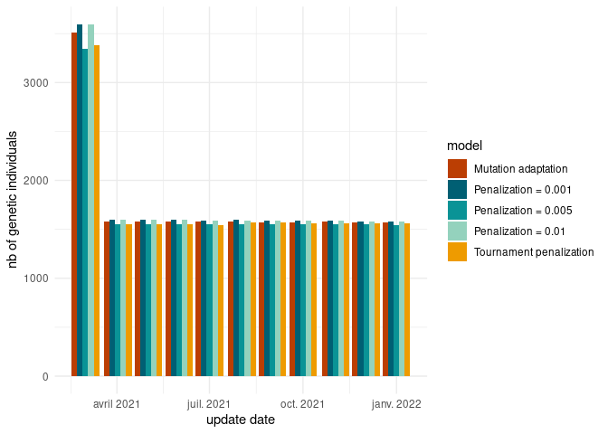
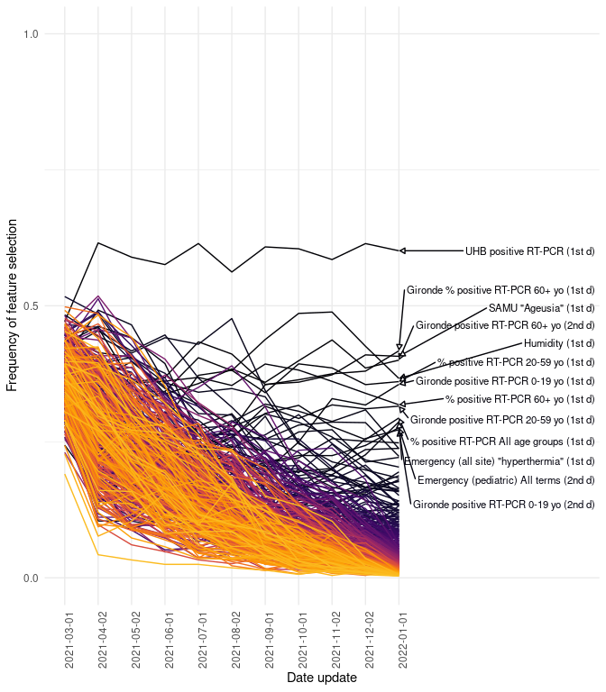

# High dimension reservoir


<script src="results_high_dim_rc_exp2_files/libs/kePrint-0.0.1/kePrint.js"></script>
<link href="results_high_dim_rc_exp2_files/libs/lightable-0.0.1/lightable.css" rel="stylesheet" />


# Introduction

# Methods

## Use case

## Reservoir computing

## Genetic algorithm

## Experimental setup

### Penalization exploration

We explored to variant of the GA optimizing both the number of features
and the MAE :

1)  We changed the fitness function from $MAE$ to
    $MAE + \theta * nbfeatures$. In this case, $\theta$ is a penalty
    term penalizing genetic individuals selecting many features. We
    explore $\theta \in \{1e^{-3}, 5*1e^{-3}, 1e^{-2})$.
2)  We changed the tournament selection. When selecting new parents, we
    perform a three individuals tournament (instead of two), then we
    exclude the individual with the larger number of features and then
    we select the individual with the lowest $MAE$
3)  Finally, we explored an epidemiology guided feature selection where
    we keep the original GA but we only provide 11 features guided by
    expert knowledge.

# Results

## Forecast

### Sanity check

First, we check that there is 40 reservoir prediction for each day of
the prediction for each scenario. We observe that there is indeed a
forecast for each day. Some days have less than 40 reservoirs but the
minimum is 39 which seems acceptable.


### Performance

| model | update | MAE | MRE | MAEB | MREB |
|:---|:---|:---|:---|:---|:---|
| Mutation adaptation | No monthly update | 15.04(±12.02) | 0.25(±0.33) | -3.55(±6.94) | 0.85(±1.47) |
| Mutation adaptation | Monthly update | 15.32(±12.99) | 0.25(±0.35) | -3.27(±6.66) | 0.86(±1.34) |
| Penalization = 0.001 | No monthly update | 15.11(±13.08) | 0.25(±0.35) | -3.48(±6.66) | 0.84(±0.84) |
| Penalization = 0.001 | Monthly update | 15.63(±13.26) | 0.28(±0.36) | -2.96(±5.91) | 0.86(±1.61) |
| Penalization = 0.005 | No monthly update | 15.25(±12.75) | 0.26(±0.32) | -3.34(±6.88) | 0.84(±1.74) |
| Penalization = 0.005 | Monthly update | 15.19(±12.84) | 0.27(±0.34) | -3.4(±5.78) | 0.84(±0.99) |
| Penalization = 0.01 | No monthly update | 15.37(±12.84) | 0.26(±0.34) | -3.22(±6.29) | 0.87(±1.42) |
| Penalization = 0.01 | Monthly update | 15.53(±12.92) | 0.26(±0.35) | -3.05(±5.74) | 0.87(±1.07) |
| Tournament penalization | No monthly update | 15.4(±12.97) | 0.26(±0.34) | -3.19(±5.99) | 0.86(±1.42) |
| Tournament penalization | Monthly update | 14.81(±12.5) | 0.24(±0.32) | -3.78(±5.97) | 0.84(±1.25) |

Model performance


# Hyperparameters

## Sanity check



## Numeric hyperparameters

### Hyperparameter evolution


## Categorical hyperparameters


| model                   | 2021-03-01    | 2022-01-01    |
|:------------------------|:--------------|:--------------|
| Mutation adaptation     | 150.3(± 28.3) | 23.6(± 6.3)   |
| Penalization = 0.001    | 204.8(± 10.2) | 208.3(± 10)   |
| Penalization = 0.005    | 204.9(± 10.1) | 202.4(± 10.4) |
| Penalization = 0.01     | 201.7(± 10)   | 199.9(± 10.4) |
| Tournament penalization | 200.1(± 9.7)  | 196(± 9.1)    |

Number of features selected at first and last month. Mean (sd)


<!-- ```{r fig.height=8} -->
<!-- df_plot <- df_freq_selection |>  -->
<!--   filter(model == "Epidemio") |>  -->
<!--   group_by(name) |>  -->
<!--   mutate(mean_prop = sum(value*(last_used_observation == "2022-01-01"))) |> -->
<!--   ungroup() |>  -->
<!--   mutate(name = FctCleanFeaturesName(name), -->
<!--          name = as.factor(name), -->
<!--          name = forcats::fct_reorder(name, -mean_prop), -->
<!--          deriv = grepl(name, pattern = "(1st d)"), -->
<!--          deriv = factor(deriv, -->
<!--                         levels = c(F,T), -->
<!--                         labels = c("Raw", "1st derivative"))) -->
<!-- ggplot(data = df_plot, -->
<!--        mapping = aes(y = value, -->
<!--                      x = last_used_observation, -->
<!--                      group = name, -->
<!--                      label = name, -->
<!--                      color = name)) + -->
<!--   geom_line() + -->
<!--   geom_text_repel(data = df_plot |>  -->
<!--                     filter(last_used_observation == "2022-01-01"), -->
<!--                   size = 3, -->
<!--                   nudge_x = 6, -->
<!--                   direction = "y", -->
<!--                   force = 5, -->
<!--                   arrow = arrow(length = unit(0.01, "npc"), type = "closed")) + -->
<!--   scale_y_continuous(breaks = c(0,.5,1), limits = c(0,1)) + -->
<!--   scale_color_viridis_d(option = "B", end = 0.85) + -->
<!--   theme_minimal() + -->
<!--   theme(axis.text.x = element_text(angle = 90), -->
<!--         legend.position = "none") + -->
<!--   labs(y = "Frequency of feature selection", -->
<!--        x = "Date update") -->
<!-- ``` -->


